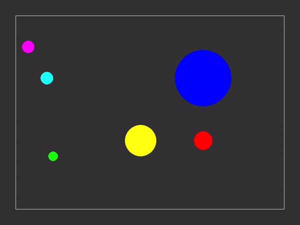

# PySimul
Simulations using pygame

## How to Run
### Setup
windows
```shell
>python -m pip install -r requirements.txt
```

linux
```shell
>python3 -m pip install -r requirements.txt
```

### Run
windows
```shell
>python simulation.py [Simulation Type]
```
linux
```shell
>python3 simulation.py [Simulation Type]
```

## Description

### General
- press <kbd>Space</kbd> to play/pause the simulation
- to change the simulation settings, see `general/config.py` and `simulation/[Simulation Type]/config.py`

### Double Pendulum

- commandline argument: `pendulum`

### Elastic Collision

- commandline argument: `elastics`

### Electric Field

- commandline argument: `electric`

